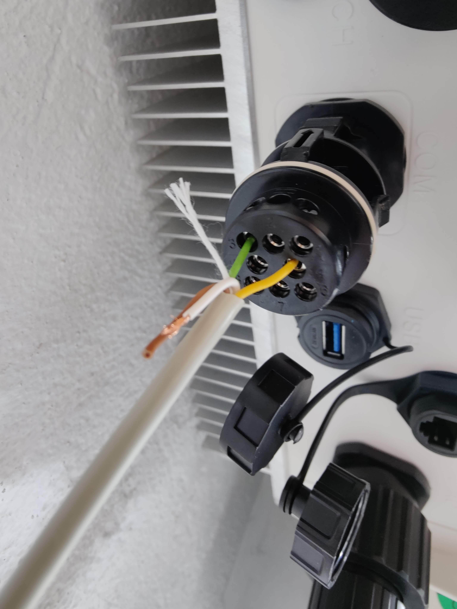
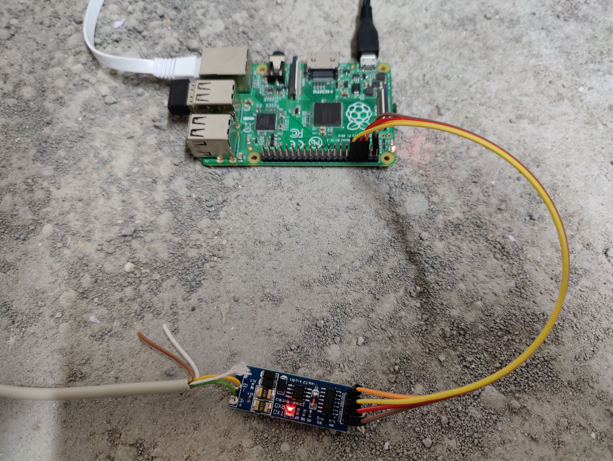
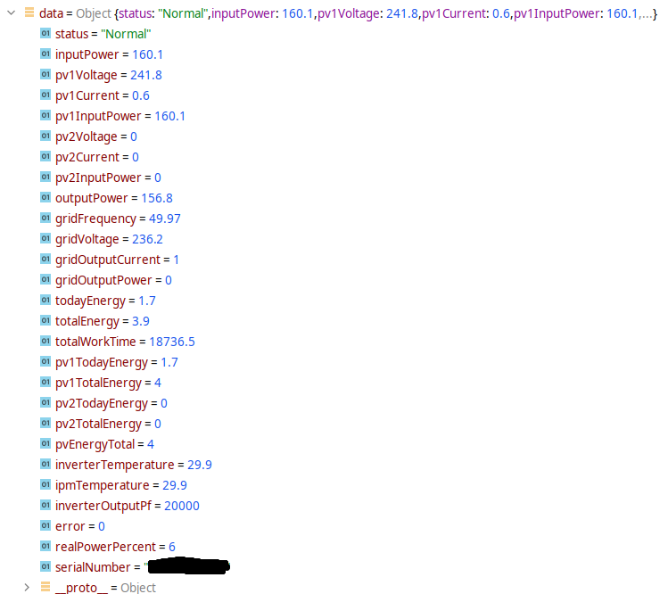

## Growatt Modbus
This library natively reads data provided by a growatt inverter.
Parsing is based on the documentation "Growatt Inverter Modbus RTU Protocol_II" (V1.05 2018-04-19).


## Setup
Connect the pin 3 and 4 (modbus A and B) of the growatt COM connector to a modbus to serial converter (e.g. rs485 to TTL converter). 
Multiple inverters can be connected to the same converter. Make sure to provide the correct modbusId for each inverter. 
The modbusId can be changed in the configuration menu of the inverter (default: 1).  



## Installation
```shell
yarn add growatt-modbus
```


## Usage
```js
import GrowattClient from 'growatt-modbus';

(async () => {
    const growattClient = new GrowattClient({
        baudRate: 9600,
        device: '/dev/ttyAMA0',
        modbusId: 1
    });
    await growattClient.init();
    const data = await growattClient.getData();
})();
```

## Output Example



## Tested devices
- [x] Growatt MIC 2500TL-X
- [x] Growatt MIN 4200TL-XE


## Contributing

The parsed data is far from everything the inverter provides but enough for my needs right now. Feel free to open a PR to support information. 

<style type="text/css">
    img {
        width: 300px;
    }
</style>
